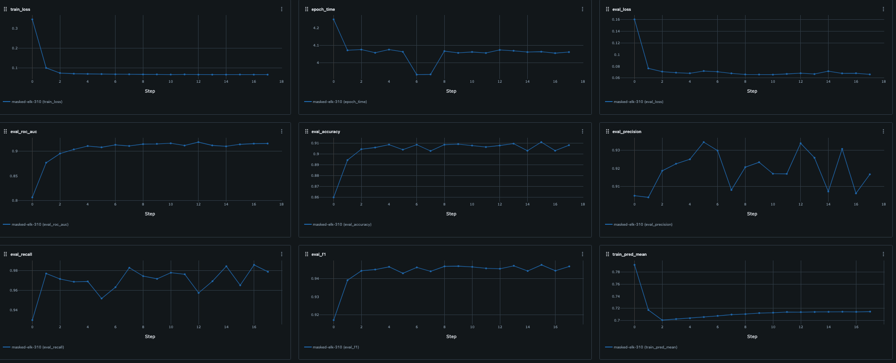
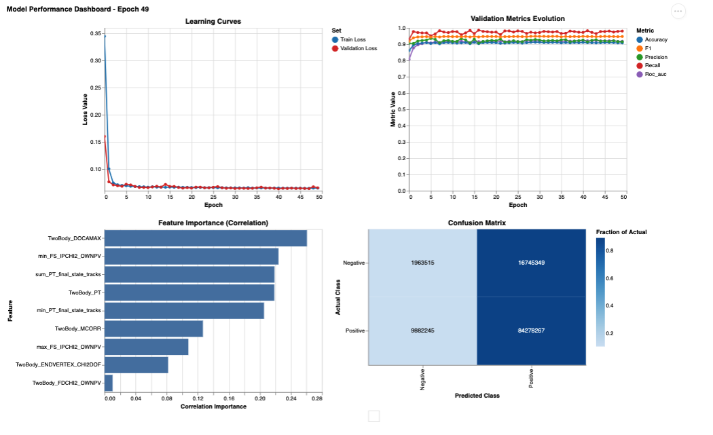
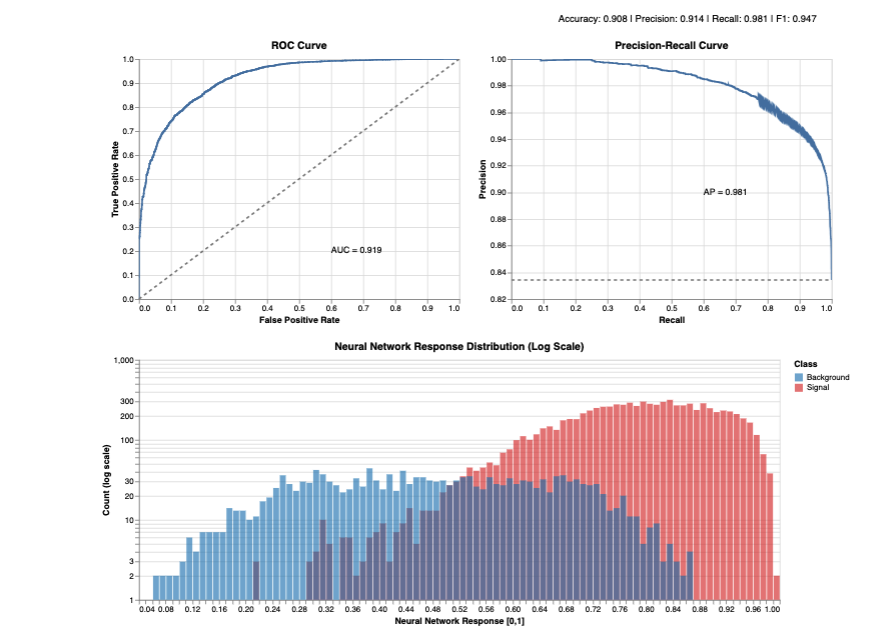

# TopoNNOps: Neural Networks with Topological Constraints

TopoNNOps is a framework for training neural networks with topological constraints such as Lipschitz continuity and monotonicity. The framework provides implementations of both standard unconstrained neural networks and constrained architectures.

## Features

- Unconstrained neural networks with customizable architectures
- Lipschitz-constrained neural networks
- Optional monotonicity constraints on specific input features
- Comprehensive training loop with MLflow tracking
- Visualization tools for model performance

## Setup

### Requirements

This project requires Python 3.8+ and PyTorch. Install all dependencies using:

```bash
pip install -r requirements.txt
```

For Lipschitz-constrained networks with monotonicity constraints, you'll need the `monotonenorm` package:

```bash
pip install monotonenorm
```

### Project Structure

```
TopoNNOps/
├── config/                # Configuration files
│   ├── config.yaml        # Main configuration
│   └── features.yml       # Feature constraints for monotonicity
├── data.py                # Data loading and preprocessing
├── loss.py                # Custom loss functions
├── main.py                # Main training script
├── models.py              # Neural network architectures
├── requirements.txt       # Project dependencies
├── setup_mlflow_remote.sh # Script to start MLflow server
├── trainer.py             # Training loop implementation
├── visualization.py       # Performance visualization
└── weight_visualization.py # Weight visualization tools
```

## Model Architectures

### UnconstrainedNet

A flexible neural network implementation with:
- Customizable layer dimensions
- Various activation functions (ReLU, LeakyReLU, ELU, GELU, etc.)
- Optional batch normalization and dropout
- L1 regularization
- Residual connections
- Different weight initialization methods

### LipschitzNet

A neural network with Lipschitz constraints, optionally with monotonicity:
- Enforces a global Lipschitz constant
- Uses GroupSort activation for Lipschitz guarantees
- Supports feature-specific monotonicity constraints via SigmaNet
- Configurable through features.yml

## Example UI via MLflow 
The framework includes a simple UI for visualizing model performance metrics, ROC curves, confusion matrices, and learning curves, and so on. This helps in understanding the model's evolving behaviour during the training - as evaluated on a validation dataset.






## Usage

### Setting Up MLflow Tracking

To start the MLflow tracking server:

```bash
bash setup_mlflow_remote.sh
```

This will set up MLflow based on your configuration and allow you to track experiments.

### Configuration

Create a configuration file (or modify the existing one) in the `config` directory:

```yaml
# Example config.yaml
model:
  identifier: "unconstrained"  # or "lipschitz", "lipschitz_monotonic"
  layer_dims: [64, 32, 16]
  dropout_rate: 0.1
  batch_norm: false
  activation_fn: "relu"
  l1_factor: 0.0001
  residual: false
  init_method: "xavier_uniform"
  # For Lipschitz models
  lip_const: 1.0
  monotonic: false
  nbody: "TwoBody"

optimizer:
  name: "adam"
  lr: 0.001
  weight_decay: 0.0001
  beta1: 0.9
  beta2: 0.999

training:
  num_epochs: 100
  batch_size: 256
  loss_fn: "bce_with_logits"
  grad_clip_val: 1.0
  use_mixed_precision: true
  early_stopping_patience: 10

paths:
  train_data: "data/train.csv"
  test_data: "data/test.csv"

mlflow:
  tracking_uri: "http://localhost:5000"
  experiment_name: "topo_nn_experiment"

metrics:
  threshold: 0.5
  compute:
    roc_auc: true
    accuracy: true
    precision: true
    recall: true
    f1: true
```

### Running the Training

To run the training, simply execute:

```bash
python main.py
```

You can override configuration options via command line:

```bash
python main.py model.layer_dims=[128,64,32] training.batch_size=512
```

## Key Components

### Trainer

The `Trainer` class provides a comprehensive training loop with:
- Mixed precision training
- Gradient clipping
- Learning rate scheduling
- Early stopping
- Performance metrics calculation
- MLflow logging
- Visualization generation

### Data Module

The `LHCbMCModule` handles data loading and preprocessing for LHCb Monte Carlo data:
- Supports custom batch sizes
- Handles signal-to-background ratios
- Provides data scaling
- Feature column management

### Visualization

Visualization tools include:
- Performance metrics dashboards
- ROC curves
- Confusion matrices
- Learning curves
- Weight visualizations

## Contributing

Contributions are welcome! Please make sure to update tests as appropriate.

## License
[MIT License](LICENSE)

